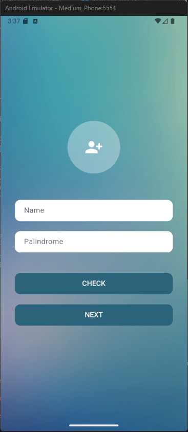
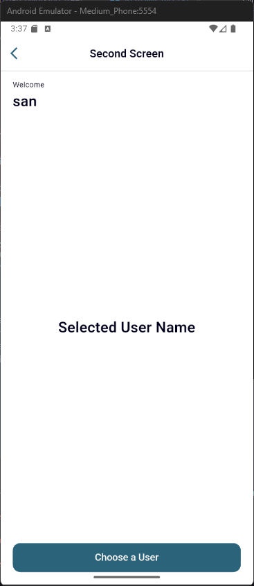
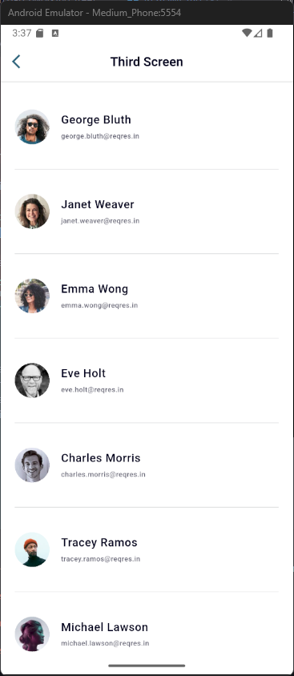

# Suitmedia Technical Test - Flutter App

## 📱 Overview

Aplikasi Flutter dengan 3 screen utama:
1. **First Screen** - Form input dengan palindrome checker
2. **Second Screen** - Welcome screen dengan nama user
3. **Third Screen** - User list dari ReqRes API

## 📸 Screenshots

| First Screen | Second Screen | Third Screen |
|:---:|:---:|:---:|
|  |  |  |
| Form input & palindrome checker | Welcome & user selection | User list from API |

## 🛠 Tech Stack

- Flutter 3.8.1+ | GetX | HTTP Client | Poppins Font

## 🚀 Getting Started

```bash
git clone https://github.com/unvbld/suitmedia-technicaltest.git
cd suitmedia-technicaltest/suitmedia
flutter pub get
flutter run
```

## ✨ Features

- [x] Form validation & palindrome checker
- [x] Navigation dengan parameter passing  
- [x] API integration dengan error handling
- [x] Pull to refresh & infinite scroll
- [x] Custom styling & responsive design

---

**Made for Suitmedia Technical Test**
